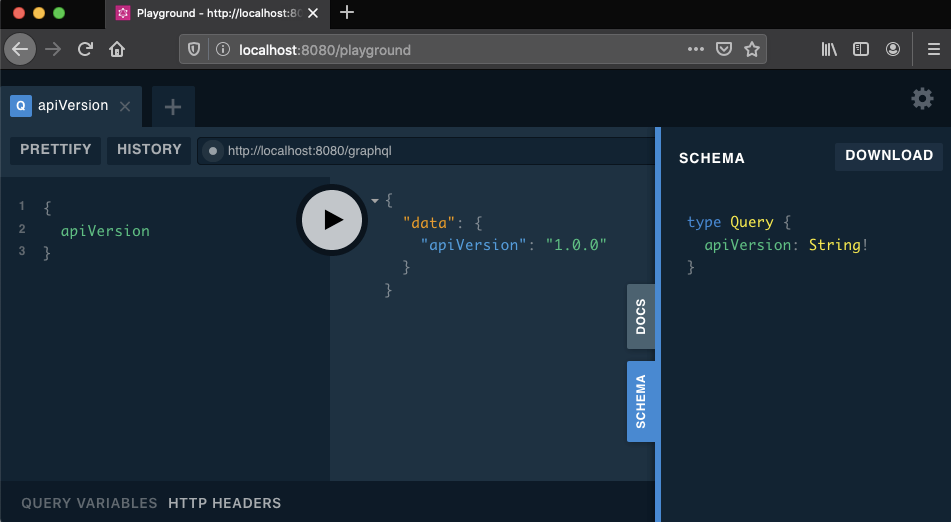

## Project Setup
Create project using [Spring Initializer](https://start.spring.io/#!type=gradle-project&language=kotlin&platformVersion=2.3.0.RELEASE&packaging=jar&jvmVersion=11&groupId=com.example&artifactId=demo&name=demo&description=Demo%20project%20for%20Spring%20Boot&packageName=com.example.demo&dependencies=actuator,cloud-starter-sleuth,cloud-starter-zipkin)
and add the following dependencies in `build.gradle.kts`:

```
implementation("org.springframework.boot:spring-boot-starter-actuator")
implementation("org.springframework.cloud:spring-cloud-starter-sleuth")
implementation("org.springframework.cloud:spring-cloud-starter-zipkin")
implementation("com.expediagroup:graphql-kotlin-spring-server:2.1.1")
```
Reference: https://expediagroup.github.io/graphql-kotlin/docs/spring-server/spring-overview#setup

## Create `apiVersion` Query
 
Create a class extending `Query` with a single function returning the api version:

```kotlin
@Component
class ApiVersion: Query {
    fun apiVersion(): String = "1.0.0"
}
```
To ensure the schema will be generated configure the server so it scans the package of your query, modify `/src/main/resources/application.properties`
```properties
graphql.packages=l30thelion.spacexgraphqlkotlinserver
```
Reference: https://expediagroup.github.io/graphql-kotlin/docs/spring-server/spring-overview#configuration

## Run Server
```shell script
./gradlew bootRun
```
```
  .   ____          _            __ _ _
 /\\ / ___'_ __ _ _(_)_ __  __ _ \ \ \ \
( ( )\___ | '_ | '_| | '_ \/ _` | \ \ \ \
 \\/  ___)| |_)| | | | | || (_| |  ) ) ) )
  '  |____| .__|_| |_|_| |_\__, | / / / /
 =========|_|==============|___/=/_/_/_/
 :: Spring Boot ::        (v2.3.0.RELEASE)

2020-05-24 17:26:28.077  INFO [,,,] 79299 --- [           main] l.s.ApplicationKt                        : No active profile set, falling back to default profiles: default
2020-05-24 17:26:29.009  INFO [,,,] 79299 --- [           main] o.s.cloud.context.scope.GenericScope     : BeanFactory id=72784f00-083e-3c6f-8f84-1d1048049d0d
2020-05-24 17:26:30.091  INFO [,,,] 79299 --- [           main] c.e.g.spring.SchemaAutoConfiguration     : 
schema {
  query: Query
}

"Directs the executor to include this field or fragment only when the `if` argument is true"
directive @include(
    "Included when true."
    if: Boolean!
  ) on FIELD | FRAGMENT_SPREAD | INLINE_FRAGMENT

"Directs the executor to skip this field or fragment when the `if`'argument is true."
directive @skip(
    "Skipped when true."
    if: Boolean!
  ) on FIELD | FRAGMENT_SPREAD | INLINE_FRAGMENT

"Marks the field or enum value as deprecated"
directive @deprecated(
    "The reason for the deprecation"
    reason: String! = "No longer supported"
  ) on FIELD_DEFINITION | ENUM_VALUE

type Query {
  apiVersion: String!
}

2020-05-24 17:26:30.388  INFO [,,,] 79299 --- [           main] o.s.b.a.e.web.EndpointLinksResolver      : Exposing 2 endpoint(s) beneath base path '/actuator'
2020-05-24 17:26:30.997  INFO [,,,] 79299 --- [           main] o.s.b.web.embedded.netty.NettyWebServer  : Netty started on port(s): 8080
2020-05-24 17:26:31.018  INFO [,,,] 79299 --- [           main] l.s.ApplicationKt                        : Started ApplicationKt in 3.614 seconds (JVM running for 3.826)

```

## Explore Server using GraphQL Playground
Navigate embedded GraphQL Playground [http://localhost:8080/playground](http://localhost:8080/playground)




https://documenter.getpostman.com/view/2025350/RWaEzAiG?version=latest